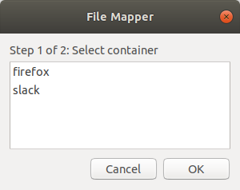
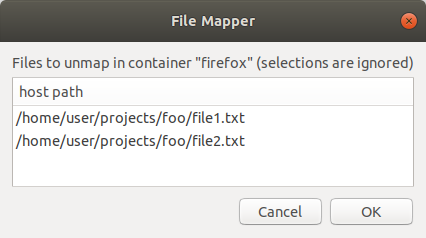

# Introduction

This project seeks to use containers to provide isolation to the host system for running graphical applications. There is at least one security focused project ([x11docker](https://github.com/mviereck/x11docker)) that accomplishes this with Docker, but I wanted to use [lxd containers](https://linuxcontainers.org/). A [simple](https://blog.simos.info/how-to-easily-run-graphics-accelerated-gui-apps-in-lxd-containers-on-your-ubuntu-desktop/) [solution](https://stgraber.org/2014/02/09/lxc-1-0-gui-in-containers/) exists for Linux hosts that involves sharing the X server's socket file with the container. I wanted to avoid this because access to the socket [allows the container to access the host keyboard, video, mouse, and clipboard](http://theinvisiblethings.blogspot.com/2011/04/linux-security-circus-on-gui-isolation.html).

The newer [Wayland](https://wayland.freedesktop.org/) display server system will eventually replace X and mitigates the shared resource security issue that X has. However, the issue is still present if apps make use of the compatibility layer that allows X clients to run in Wayland. [Wayland has been around since 2012](https://wayland.freedesktop.org/releases.html) and [several GUI toolkits are compatible](https://wayland.freedesktop.org/toolkits.html) as of Q3 2018. Of note, [Firefox is not yet compatible](https://bugzilla.mozilla.org/show_bug.cgi?id=635134). [Project Crostini](https://chromium-review.googlesource.com/c/chromium/src/+/879173) may have solved this problem. The project's goal is to [use LXD to run Linux apps in Chrome OS](https://blog.simos.info/a-closer-look-at-chrome-os-using-lxd-to-run-linux-gui-apps-project-crostini/).

The goal of this project is to isolate the app as much as possible while using little host resources, easy setup, and user friendly. The original use case was Firefox, but efforts were made to keep it generic enough for other apps.

The tools in this project are essentially just wrappers around LXD and xpra.

# Overview

While containers like Docker and lxd provide some isolation to the host system, their primary goal is software portability and consistency. As long as the host has the container management software installed, containers should run the same regardless of the host hardware, OS, libraries, and applications. The container is a packaged unit holding everything needed to run the application.

At one end of the isolation spectrum, system virtual machines (VM), or hypervisors, virtualize hardware to their guests and provide a high degree of isolation with the host and other VMs. Separate resources are created for guest VMs. At the other end of the spectrum, application sandboxes are a more lightweight isolation mechanism usually taking less resources for enforcing isolation, but in doing so relying on shared resources with the host and indirectly with other containers.

## Types of Isolation

* system virtualization (i.e., VM, hypervisor) - [VMware](https://www.vmware.com/), [VirtualBox](https://www.virtualbox.org/), [QEMU-KVM](https://www.linux-kvm.org/page/Main_Page), [Xen](https://xenproject.org/), [Qubes OS](https://www.qubes-os.org/), [Multipass](https://multipass.run/)
  * Qubes OS - compartmentalizes activities into domains (AppVMs [Xen virtual machines])
* OS virtualization (i.e., container) - [Docker](https://www.docker.com/), [LXD](https://linuxcontainers.org/), [Rocket](https://coreos.com/rkt/), [User-mode Linux](http://user-mode-linux.sourceforge.net/)
* app virtualization (i.e., sandbox)
  * [Firejail](https://firejail.wordpress.com/) - [code](https://github.com/netblue30/firejail), [blog series](https://l3net.wordpress.com/2014/09/19/firejail-a-security-sandbox-for-mozilla-firefox/), [tutorial and comparision](https://ownyourbits.com/2017/10/29/sandbox-your-applications-with-firejail/). "Restricts the running environment of untrusted applications using Linux namespaces and seccomp-bpf". Security profiles are created per app and are used to define what to restrict. This is similar to AppArmor and as such, profiles need to be kept in sync with app updates.
  * [Bubblewrap](https://github.com/projectatomic/bubblewrap) - Similar to Firejail, but simpler and less features. Needs manual work.
  * [Sandboxie](https://www.sandboxie.com/) - Windows only. Instruments parts of the OS and creates separate resources for specific apps. [More details are in the FAQ](https://www.sandboxie.com/FrequentlyAskedQuestions#HowItWorks).
  * [chroot](https://en.wikipedia.org/wiki/Chroot) (a.k.a chroot jail) - Change what the app sees as the root of its filesystem.
  * [gVisor](https://github.com/google/gvisor) ("[not a sandbox](https://github.com/google/gvisor#why-does-gvisor-exist)") - a user-space kernel that provides an isolation boundary between the application and the host kernel. "seccomp on steroids"
  * [Oz](https://github.com/subgraph/oz) (sandbox used by [Subgraph OS](https://subgraph.com/)) - transparently wraps executables by using Linux namespaces, seccomp filters, capabilities, and X11 isolation. The OS uses a hardened Linux kernel (through grsecurity, PaX, and RAP) and a custom sandbox called Oz
  * [Subuser](http://subuser.org/) - isolates apps in Docker containers and uses XPRA to isolate GUI. “Turns Docker container into an app”
  * [Snap](https://snapcraft.io/) package - sandboxed software package. Written in Go. License is GPL 3.0. Provides packaging tools, auto updates from a remote store, and versioning. Apps are isolated from host and other apps using "confinement". Permissions for access must be declared in package meta file or manually via host commandline tool. Self-contained: all code, read-only data, and non-core libraries are stored in a read-only SquashFS image. Core libraries provided by a core snap. Security enforcement mechanisms: AppArmor, seccomp, cgroups, and namespaces.
  * [Flatpak](https://www.flatpak.org/) package - sandboxed software package. Written in C. License is LGPL 2.1. Similar to Snap. Formerly "xdg-app". Security enforcement mechanism uses bubblewrap which uses seccomp, cgroups, namespaces, and bind mounts. Identical files between app versions are deduped to save space.
  * [AppImage](https://appimage.org/) package - format for distributing apps in a self-contained image. Written in C. License is MIT. Security is not a goal. [Comparison against similar projects](https://github.com/AppImage/AppImageKit/wiki/Similar-projects)
* rules-based ([Linux Security Modules (LSM)](https://www.kernel.org/doc/htmldocs/lsm/index.html)) - AppArmor, SELinux, seccomp

## [Types](https://winswitch.org/documentation/protocols/choose.html) of GUI Isolation

* virtual desktop - RDP, VNC, NX. Too slow and not seamless
* seamless - SSH with X forwarding, NX, xpra
  * [xpra](https://xpra.org/) – Sets up a dummy (xvfb) display server (Xorg) and essentially becomes a window manager for the target app. Proxies GUI from X client to real display over the xpra connection. Window looks and feels like it is part of the real display (resizeable and framed like a normal desktop window). With default package in Ubuntu, requires changing *Xwrapper.config* file to allow anybody to start an X server. I think this was fixed in newer versions of xpra.
* shared X server – share X socket with app. Insecure as app can intercept input events on host
  * Host-based Access Control - `xhost +` to disable access control,  `xhost local:` to allow all local users, or `xhost si:localuser:#1001000` to allow container user
  * Cookie-based Access Control - Generate a MIT-MAGIC-COOKIE-1 and use `xauth add...` on both host and container, but this involves several steps. We could use `xauth generate...`  or `xauth extract...` but the host part of the display name is not easily configurable to specify the container’s hostname
* nested X server – Xephyr, Xnest. Not seamless

## Goals

* User friendly - graphical application windows integrate with native desktop (i.e., rootless or seamless)
* User friendly - minimal impact to performance and host resources
* User friendly - clipboard, sound, file transfer
* Host isolation - restricted app access to the display server
* Maintainable - updates to upstream app should not break our host isolation mechanism
* Security - there is a distinction between providing isolation as an app packaging and deployment mechanism rather than as a security control

## Limitations

* image pulled for container is latest stable Ubuntu (i.e., the `lxd init` command is passed "ubuntu:" as the remote and a null image)
* to reduce complexity, some things are hard-coded (e.g., the directory in container and host for bind mounts)
  * bind mount for xpra is hard-coded to */home/ubuntu/.xpra* in container
  * bind mount for file share is hard-coded to */home/ubuntu/share* in container
  * bind mounts for mapped files are hard-coded to */home/ubuntu/maps/* in container
* keeping the container software up-to-date is left up to the user. However, it is probably already handled by the container OS
* using an unprivileged container means more effort is needed for sharing files. This is addressed by using ACLs for the bind mount such that the container user and host user may read and write. This container user is the same across all containers.
* container user id is hard-coded to 1001000
* container networking uses the default bridge and SSH is hard-coded to use "ubuntu" username and IPv4
* it is possible that a client may try to connect to an existing display because the display numbers are chosen with a small entropy source; the `$RANDOM` parameter in Bash
* newline characters in files that are mapped into a container will cause problems
* the permissions on mapped files may not be returned to their original permissions if they were modified by the host or container user after mapping

## How it Works

The "create" tool will:

1. Create a LXD profile and add cloud-init user data. For this project, the data is normally just packages that should be installed to the container.
2. Create two bind mounts. One for storing files that xpra uses. The other for general file sharing between host and container.
3. Create the LXD container with the newly created profile.
4. Push a SSH *authorized_keys* file to the container so the "attach" tool can connect. The control channel is over SSH while data is over a shared Unix socket with the host.

The "attach" tool will:

1. start the container, if needed
2. using SSH as transport, start the xpra server
3. using Unix socket as transport, attach xpra client

The "map" tool will:

1. ask the user which file(s) they want to map into the container
2. change the ACL on the selected file(s)
3. map them in
4. keep a prompt open and wait for the user to confirm moving to the unmapping stage
5. unmap them
6. restore ACLs





# See also

* bitsandslices blog – [Run LXD container apps on separate X server](https://bitsandslices.wordpress.com/2016/05/12/run-lxd-container-apps-on-separate-x-server/)
* Stéphane Graber blog - [LXC 1.0: Unprivileged containers](https://www.stgraber.org/2014/01/17/lxc-1-0-unprivileged-containers/)
* Stéphane Graber blog - [LXC 1.0: GUI in containers](https://www.stgraber.org/2014/02/09/lxc-1-0-gui-in-containers/)
* Stéphane Graber blog - [LXD 2.0: Blog post series](https://www.stgraber.org/2016/03/11/lxd-2-0-blog-post-series-012/)
* Ubuntu Community Wiki - [CloudInit](https://help.ubuntu.com/community/CloudInit)
* [LXD docs](https://lxd.readthedocs.io/en/latest/)
* [Cloud-Init docs](https://cloudinit.readthedocs.io/)

# Installation

This project has been tested on a host with Ubuntu Bionic 18.04 and containers with Ubuntu Xenial 16.04 and Ubuntu Bionic 18.04.

* [xpra](https://www.xpra.org/) (version in Ubuntu repo is probably old so follow installation instructions on project website)
* zfsutils-linux (optional, but helps with disk space usage of lxd containers)
* lxd (the Snap package works fine) - [install guide](https://linuxcontainers.org/lxd/getting-started-cli/)
  * don't forget to add your user to the "lxd" group so they can run lxc commands
* jq
* python 2 or 3

# Usage

There are several options for customizing the look of the window to distinguish containerized apps. The following are ways to do this by passing commandline parameters to the "attach" script (for more details, see the xpra man page or website):

* window border. For example, `--border=red`
* window icon. For example, `--window-icon=/usr/share/icons/xpra.png` (NOTE: this is a client side path)
* window title. For example, `--title="my-container-app on @client-machine@"`

## Examples
1. Create the container

```
$ ./create_gui_container.sh \
my-container \
~/.ssh/id_rsa.pub \
lxd_gui_profile.yaml \
examples/cloud-config/firefox.yaml
```

2. Start app and attach to its display

 `$ ./attach_app.sh my-container "firefox https://xkcd.com/"`

## Creating a new container

You should only need to create a new cloud-init YAML config file. See the one for Firefox in the examples directory. Leave the stuff for xpra.

# Troubleshooting

1. Errors creating the container

   You can get cloud-init logs by running the following command in the container. It will create an archive file of relevant data for debugging. Among the files is *cloud-init.log* and *cloud-init-output.log* from */var/log/*.

   `cloud-init collect-logs`

2. `xpra initialization error: failed to identify the new server display!`

   This means the xpra server failed to start; probably because the app failed to start. Run the app in the container (`lxc exec`) and check for errors in the terminal and syslog. Verify all dependencies were installed.

3. Permission errors when accessing files in the file sharing bind mount

   Make sure the file's ACLs are set correctly. First, change the file's group permissions (e.g., `chmod g+rw`) so that the ACL is able to be used. You can then use `setfacl` and `getfacl` to set and get ACLs if you need to.

4. xpra server logging

   Server logs are written to the container and NOT the host. If you want the logs either pull them from the container (*/run/user/1000/xpra/*) or change the log directory when starting the xpra server in the "attach" script (`--log-dir=/home/ubuntu/.xpra`).

5. view xpra server config while server is running

   `xpra info socket:container_mounts/my-container/xpra/my-app`

6. modify xpra server config while server is running

   `xpra control socket:container_mounts/my-container/xpra/my-app help`

7. xpra commandline options

   See all options with `xpra --help`. The man page has more details, but is missing some options.

8. Errors creating the container

   The "suite" in the APT repo line for xpra may be pointing to the wrong Ubuntu distribution. Check what distribution the container is (`lsb_release -c`) and match with the cloud config YAML file.

9. An extra launcher icon is created for the app after attaching

   Add a "StartupWMClass" key to the desktop file and set its value to the value reported by `xprop 8s ' $0\n' WM_CLASS | cut -f2 -d' '`. You can also force a temporary class on the window by running `xprop -f WM_CLASS 8s -set WM_CLASS my-app`. This would have to be set each time the app was run and actually this method doesn't properly set the WM_CLASS value because `xprop` cannot set a tuple value which WM_CLASS is.

10. Sound is not working or delayed by minutes

    [The AppArmor profile on the host might be denying file locking of a Unix socket](https://github.com/lxc/lxc/issues/820). A workaround is to disable 2 properties of the systemd RealtimeKit service: `PrivateTmp=no` and `PrivateNetwork=no`. Run `systemctl edit rtkit-daemon.service` in the container.

11. Output for commandline programs

    See [issue #1](https://github.com/bitsandsalsa/lxd_gui_container/issues/1).
